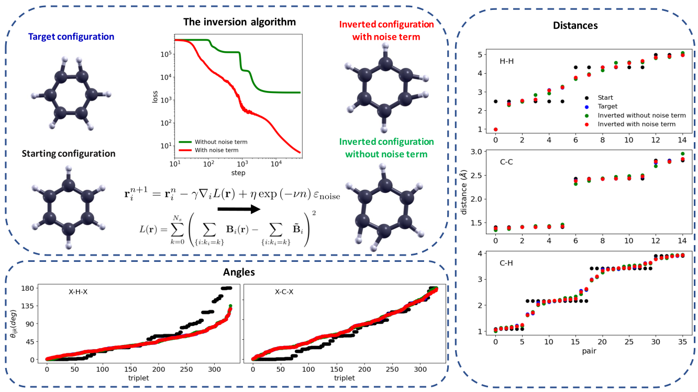

# Local inversion of the chemical environment representations
Implementation of the algorithm for the inversion of the local chemical environments descriptors:

|  |
|:--:|
|  Scheme associated to an example of inversion of the bispectrum components starting from a relaxed benzene structure. The target is a deformed benzene molecule chosen for sake of visualization. A comparison of the collection of distances and planar angles from all the atomic pairs and triplets in the molecule are shown. After $5·10^4$ iterations, of the gradient descent algorithm, the inverted configuration (red) closely resembles the target one (blue). We also show in green the result of the inversion process in absence of the noise term in the update rule. |

> https://journals.aps.org/prb/abstract/10.1103/PhysRevB.106.035402
> 
> https://arxiv.org/abs/2201.11591

For any queries, please contact me at mcobelli@tcd.ie

## Dependencies

This library makes use of ASE for the manipulation of the chemical structures, LAMMPS for the computation of the bispectrum components and of Dask to run in parallel:

> https://www.lammps.org/
> 
> https://dask.org/ (version 2021.10.0 or newer)
> 
> https://wiki.fysik.dtu.dk/ase/

## Examples

- dask_inversion.py shows an example of the inversion procedure, it makes use of the configurations in the Dataset directory.
- pbc.py small script to wrap the atoms into the unit cell for visualization purposes.
